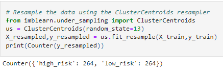
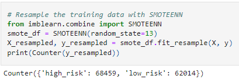

# Credit_Risk_Analysis

## Goals
The purpose of this review was to utilized supervised machine learning in an effort make predictions of likelyhood of default for existing loans.  In this process we were to utilized multiple types of supervised learning to include oversampling, undersampling and SMOTE. These methods were utilized due to the unbalanced data set and a need to balance them for improved predictions.

## Analysis
Initial review showed that the data set was in excess of 115K loan applications.  The loan applications were narrowed down by focusing only on parameters deemed to constitute high and low risk loans.  This resulted in narrowing the data down to 68,817 loans as pictured below.

The data was then split into test and training data utilizing the train_test_split method.

### Oversampling

#### Random Oversampling
In this method I utilized the RandomOverSampler model which randomly picks and replicates the data from the minority class until the sampled amount from the minority class equals that of the majority class.

- Balanced Accuracy Score was 64.3%
- High Risk Precision rate was 1% while the recall/sensitivity was 63% resulting in an F1 score of 2%.
- Low Risk Precision rate was 100% while the recall/sensitivity was 66% resulting in an F1 score of 79%.

#### SMOTE
Next we attempted to utilize the SMOTE model which creates sythetic values for the minority class instead of replicating existing values.
The results of this method were as follows.

- Balanced Accuracy Score was 60.4%
- High Risk Precision rate was 1% while the recall/sensitivity was 54% resulting in an F1 score of 2%.
- Low Risk Precision rate was 100% while the recall/sensitivity was 67% resulting in an F1 score of 80%.

### Undersampling

#### Cluster Centroids Model
This is defined as an algorithm that identifies clusters of the majority class to generate synthetic data points that are representative of the clusters.

While utilizing this method it reduced the population to 264 instances of each.

- Balanced Accuracy Score was 50.5%
- High Risk Precision rate was 0% while the recall/sensitivity was 51% resulting in an F1 score of 1%.
- Low Risk Precision rate was 100% while the recall/sensitivity was 50% resulting in an F1 score of 67%.

### SMOTEEN to Predict Credit Risk
SMOTEEN is the method of using both oversampling and undersampling to predit a result.

- Balanced Accuracy Score was 64.8%
- High Risk Precision rate was 1% while the recall/sensitivity was 70% resulting in an F1 score of 2%.
- Low Risk Precision rate was 100% while the recall/sensitivity was 60% resulting in an F1 score of 75%.

### Balanced Random Forest Classifier Model
This method creates two trees of the same size and equal to the minority class to represent one from each class.

- Balanced Accuracy Score was 73.9%.
- High Risk Precision rate was 2% while the recall/sensitivity was 59% resulting in an F1 score of 5%.
- Low Risk Precision rate was 100% while the recall/sensitivity was 89% resulting in an F1 score of 94%.

### Easy Ensemble AdaBoost Classifier
This is a set of classifiers where individual decisions are combined to classify new examples.

- Balanced Accuracy Score was 91.7%.
- High Risk Precision rate was 6% while the recall/sensitivity was 90% resulting in an F1 score of 11%.
- Low Risk Precision rate was 100% while the recall/sensitivity was 93% resulting in an F1 score of 96%.

## Summary
In review the Easy Ensemble Classifier had the best results as it had an accuracy of 91.7%, compared to most other models which was below 65%.  As such the recommendation of this user is to utilize this method going forward.
